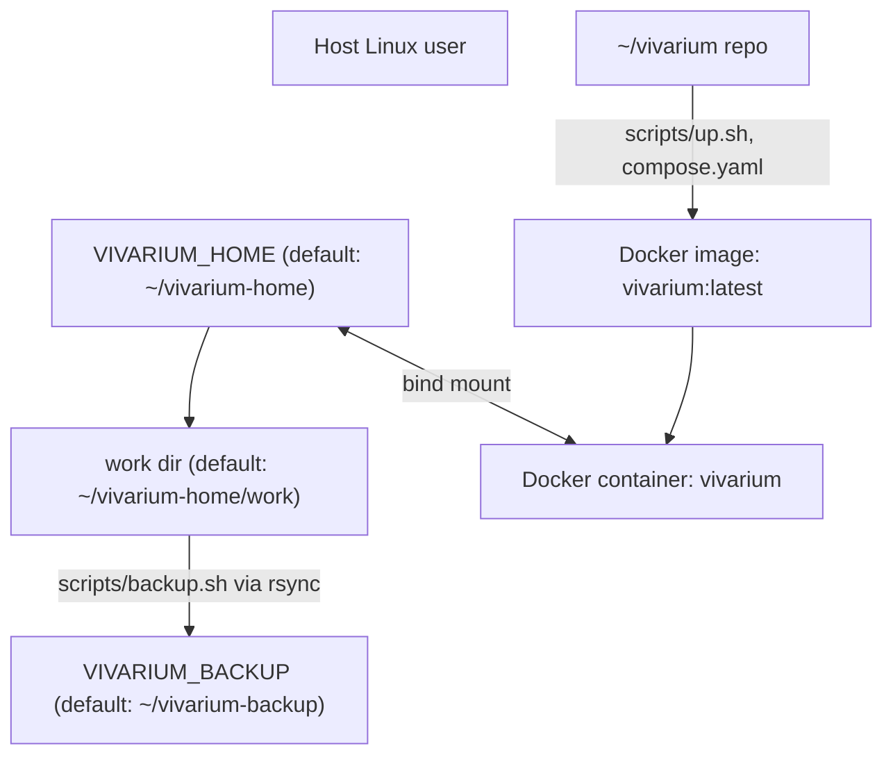
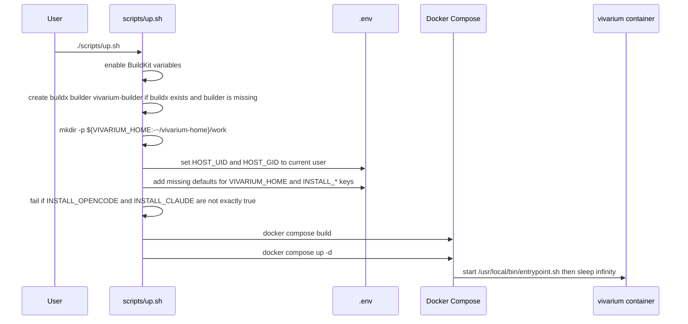
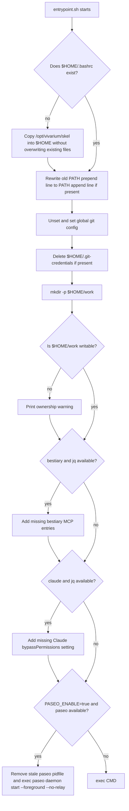
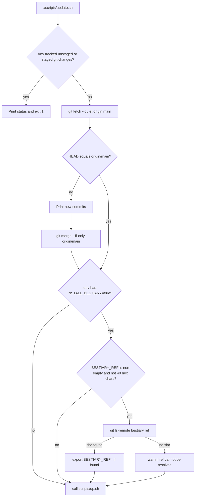
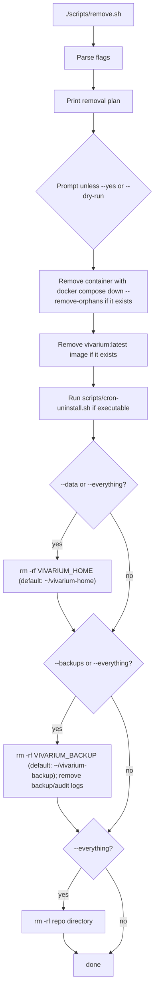

# vivarium docs

Vivarium runs agent CLIs inside one Docker container. The host keeps the persistent home directory; the image supplies tools and startup safety config.

## Implemented architecture



Container facts from `compose.yaml` and `Dockerfile`:

- Service name, container name, and image name are all `vivarium` / `vivarium:latest`.
- The image base is `ubuntu:24.04`.
- The final image user name is `vivarium`.
- `scripts/up.sh` writes build args so the image user/group match the current host UID/GID. Run it as a non-root host user; if run as root, it writes UID/GID `0`.
- The only active volume mount is `${VIVARIUM_HOME:-${HOME}/vivarium-home}:/home/vivarium`.
- The container working directory is `/home/vivarium/work`.
- Compose passes `PASEO_ENABLE` and `PASEO_HOSTNAMES` into the container.
- Compose maps `${PASEO_BIND_ADDR:-127.0.0.1}:6767:6767`.
- Runtime hardening is `cap_drop: [ALL]`, `cap_add: [CHOWN, DAC_OVERRIDE, FOWNER, SETUID, SETGID]`, and `no-new-privileges:true`.
- Runtime limits are `mem_limit: 4g`, `cpus: 2.0`, and `pids_limit: 512`.
- Restart policy is `unless-stopped`.
- `openssh-client` is not installed by the Dockerfile.
- `/var/run/docker.sock` is not mounted by `compose.yaml`.

## Files

| Path | Implemented purpose |
|---|---|
| `Dockerfile` | Builds the Ubuntu image, installs system tools, optional agent CLIs, optional bestiary, creates the `vivarium` user from the configured UID/GID, and sets the entrypoint. |
| `compose.yaml` | Builds/runs the `vivarium` service with the bind mount, hardening, limits, and restart policy. |
| `entrypoint.sh` | Initializes home on first run, reapplies git safety config on every start, creates `~/work`, auto-wires bestiary MCP config when available, auto-adds Claude bypass permissions when available, and can start paseo when enabled. |
| `.env.example` | Template for values that Docker Compose and scripts use. |
| `scripts/up.sh` | Creates/updates `.env`, creates the host home/work directory, builds the image, and starts the container. |
| `scripts/shell.sh` | Starts the container if needed, then opens `bash` inside it. |
| `scripts/update.sh` | Refuses tracked unstaged/staged changes, fetches `origin main`, fast-forwards if needed, optionally resolves `BESTIARY_REF`, then calls `scripts/up.sh`. |
| `scripts/backup.sh` | Rsyncs `vivarium-home/work` into rotating backup slots. |
| `scripts/audit.sh` | Checks container state, backup freshness, repo remotes, tracked secret-like files, dangerous per-repo git config, MCP entries, and `.ssh` files. |
| `scripts/cron-install.sh` | Installs vivarium backup/audit cron lines and removes older vivarium cron lines first. |
| `scripts/cron-uninstall.sh` | Removes only cron lines containing `vivarium/scripts`. |
| `scripts/remove.sh` | Removes container/image/cron by default; optional flags remove data, backups/logs, and the repo. |

## Setup flow



Run it:

```bash
git clone https://github.com/blackhat-7/vivarium.git ~/vivarium
cd ~/vivarium
./scripts/up.sh
./scripts/shell.sh
```

After `scripts/shell.sh`, you are in `bash` inside the container. The default directory is `/home/vivarium/work` if it exists.

## `.env` behavior

`scripts/up.sh` creates `.env` if it is missing.

On every run, it sets these to the current host user:

```dotenv
HOST_UID=<id -u>
HOST_GID=<id -g>
```

It adds these defaults only when the key is missing:

```dotenv
VIVARIUM_HOME=<current host $HOME>/vivarium-home
INSTALL_OPENCODE=true
INSTALL_CLAUDE=false
INSTALL_PASEO=false
INSTALL_BESTIARY=false
BESTIARY_REF=main
```

`INSTALL_OPENCODE=true` or `INSTALL_CLAUDE=true` must be present exactly. `INSTALL_BESTIARY=true` does not satisfy the agent-CLI requirement.

## Image contents

The Dockerfile installs these base tools:

- `ca-certificates`, `curl`, `wget`, `git`
- `tmux`, `vim`, `nano`, `less`
- `build-essential`, `pkg-config`
- `ripgrep`, `fd`, `jq`, `sqlite3`
- `gnupg2`, `pass`
- `python3`, `python3-pip`, `python3-venv`, `python-is-python3`
- `unzip`, `xz-utils`
- Node.js 20 from NodeSource
- `uv` and `uvx` in `/usr/local/bin`

The Dockerfile also sets global npm config `ignore-scripts=true`.

Optional image features:

| Flag | Default | Implemented behavior |
|---|---:|---|
| `INSTALL_OPENCODE` | `true` | Installs opencode with `https://opencode.ai/install`; build fails with `[FATAL] opencode install failed...` if installation fails. |
| `INSTALL_CLAUDE` | `false` | Installs `@anthropic-ai/claude-code` globally with npm and `--ignore-scripts=false`; build fails with `[FATAL] claude-code install failed...` if installation fails. |
| `INSTALL_PASEO` | `false` | Installs `@getpaseo/cli` globally with npm and `--ignore-scripts=false`; build fails with `[FATAL] paseo install failed...` if installation fails. |
| `INSTALL_BESTIARY` | `false` | Installs bestiary from `git+https://github.com/blackhat-7/bestiary.git@${BESTIARY_REF}` into `/opt/bestiary`; links `bestiary` into `/usr/local/bin`; build fails with `[FATAL] bestiary install failed...` if installation fails. |

## Container startup behavior



First-run skeleton `.bashrc` contains:

```bash
export PATH="$PATH:$HOME/.local/bin"
alias ll="ls -la"
alias g=git
alias gs="git status"
export EDITOR=vim
[ -d ~/work ] && cd ~/work
```

Every container start reapplies this global git config:

```bash
git config --global core.hooksPath /dev/null
git config --global credential.helper 'cache --timeout=86400'
git config --global init.defaultBranch main
git config --global pull.rebase false
```

Before setting those values, `entrypoint.sh` runs `git config --global --unset-all` for each of those keys.

If bestiary is installed, `entrypoint.sh` adds missing entries only:

`~/.config/opencode/opencode.json`:

```json
{ "mcp": { "bestiary": { "type": "local", "command": ["bestiary", "serve"], "enabled": true } } }
```

`~/.claude.json`:

```json
{ "mcpServers": { "bestiary": { "command": "bestiary", "args": ["serve"] } } }
```

Existing bestiary entries are left unchanged. Invalid JSON causes a warning and is not overwritten.

If claude is installed, `entrypoint.sh` adds this missing key only:

```json
{ "permissions": { "defaultMode": "bypassPermissions" } }
```

The file is `~/.claude/settings.json`. Existing `permissions.defaultMode` is left unchanged.

If `PASEO_ENABLE=true` and `paseo` is installed, `entrypoint.sh`:

- sets `PASEO_LISTEN` to `0.0.0.0:6767` when it is unset;
- sets `PASEO_HOSTNAMES` to `true` when it is unset;
- removes `$HOME/.paseo/paseo.pid`;
- prints startup, hostnames, and pairing messages;
- replaces the container command with `paseo daemon start --foreground --no-relay`.

If `PASEO_ENABLE` is not `true` or `paseo` is not installed, the entrypoint runs the normal container command.

## Paseo remote-access

Paseo has a build-time flag and a runtime flag.

```dotenv
INSTALL_PASEO=true
PASEO_ENABLE=true
# optional host bind address; compose defaults to 127.0.0.1
PASEO_BIND_ADDR=127.0.0.1
# optional Host-header allowlist; entrypoint defaults to true when unset
PASEO_HOSTNAMES=
```

When enabled at build time, the Dockerfile installs `@getpaseo/cli`. When enabled at runtime, the entrypoint starts `paseo daemon start --foreground --no-relay` instead of `sleep infinity`.

Pairing state is under `$HOME/.paseo`, which is inside the bind-mounted vivarium home. The daemon listens inside the container on `0.0.0.0:6767`; Compose publishes it on host port `6767` bound to `${PASEO_BIND_ADDR:-127.0.0.1}`.

## Daily use

```bash
cd ~/vivarium
./scripts/shell.sh
```

`scripts/shell.sh` runs `docker compose up -d` first if the `vivarium` service is not running, then runs:

```bash
docker compose exec vivarium bash
```

Inside the container, clone and work under:

```bash
/home/vivarium/work
# same directory as:
~/work
# host path by default:
~/vivarium-home/work
```

## Update behavior



`scripts/update.sh` always calls `scripts/up.sh` after the fetch/merge path succeeds.

## Backups and cron

`scripts/backup.sh` runs on the host and reads:

```bash
SRC=${VIVARIUM_HOME:-$HOME/vivarium-home}/work
DEST_ROOT=${VIVARIUM_BACKUP:-$HOME/vivarium-backup}
```

If `SRC` does not exist or is empty, it prints `work dir empty; skipping` and exits successfully.

When there is work to back up, it rsyncs to:

```bash
$DEST_ROOT/hourly-$(date +%H)
```

Excluded names are:

```text
node_modules
.venv
target
__pycache__
.next
dist
build
```

Additional backup slots:

- If `backup.sh` is invoked during hour `03`, it syncs the hourly slot to `$DEST_ROOT/daily-$(date +%u)` using `--link-dest`.
- If `backup.sh` is invoked during Sunday hour `03`, it syncs the hourly slot to `$DEST_ROOT/weekly-$(( ISO_WEEK % 8 + 1 ))` using `--link-dest`.
- The default cron line runs `0 */2 * * *`, so it runs on even hours and does not invoke the hour-`03` daily/weekly branches.

`scripts/cron-install.sh` installs these vivarium cron jobs, using the repo path where the script lives and expanding the current host `$HOME` at install time:

```cron
0 */2 * * * bash <repo>/scripts/backup.sh >> <home>/vivarium-backup.log 2>&1
0 9 1 * * bash <repo>/scripts/audit.sh > <home>/vivarium-audit.log 2>&1
```

Before installing, it removes existing crontab lines that contain `vivarium/scripts` and preserves other lines.

`scripts/cron-uninstall.sh` removes crontab lines that contain `vivarium/scripts`. If no other lines remain, it removes the crontab.

## Audit behavior

`scripts/audit.sh` runs on the host. It exits with code `1` if any failure is recorded; warnings do not make it fail.

It checks:

- Whether a running Docker container named `vivarium` exists.
- Whether the newest entry under `${VIVARIUM_BACKUP:-$HOME/vivarium-backup}` is less than 4 hours old.
- Repositories under `${VIVARIUM_HOME:-$HOME/vivarium-home}/work`, searching for `.git` directories up to depth 3.
- Whether each found origin URL is HTTPS when an origin URL exists.
- Whether tracked files look secret-like by this regex: `\.(env|pem|key|p12)$|^\.secrets/|(^|/)\.git-credentials$|(^|/)id_rsa($|\.)`.
- Whether local repo config sets any of: `core.fsmonitor`, `core.editor`, `core.pager`, `core.sshCommand`, `core.hooksPath`.
- If host `jq` exists, whether opencode and claude MCP config names are all in the known-good list: `bestiary`.
- Whether `${VIVARIUM_HOME:-$HOME/vivarium-home}/.ssh` exists and contains files.

The audit also prints manual reminders to rotate tokens, check provider caps when using pay-per-token providers, skim `docker logs vivarium`, and refresh the base image quarterly.

## Remove behavior



Flags:

| Flag | Implemented behavior |
|---|---|
| `--data` | Also deletes `${VIVARIUM_HOME:-$HOME/vivarium-home}`. |
| `--backups` | Also deletes `${VIVARIUM_BACKUP:-$HOME/vivarium-backup}` and `~/vivarium-backup.log` / `~/vivarium-audit.log`. |
| `--everything` | Enables `--data`, `--backups`, and repo deletion. |
| `--yes`, `-y` | Skips confirmation prompts. |
| `--dry-run`, `-n` | Prints commands instead of running them. |
| `--help`, `-h` | Prints the script header help. |

Default removal stops/removes the container if present, removes `vivarium:latest` if present, and removes vivarium cron entries. It preserves `vivarium-home`, backups, logs, and the repo.

## What vivarium does not implement

- No Docker socket mount.
- No privileged container setting.
- No Docker `user:` override in `compose.yaml`; the user is set in the image.
- No network allowlist or DNS override is active in `compose.yaml`.
- No automatic GitHub PAT creation or validation.
- No automatic agent authentication.
- No automatic secret loading from `.env.d` or project env files.
- No global gitignore is configured by the Dockerfile or entrypoint.
- No local test harness or CI scripts are present.
