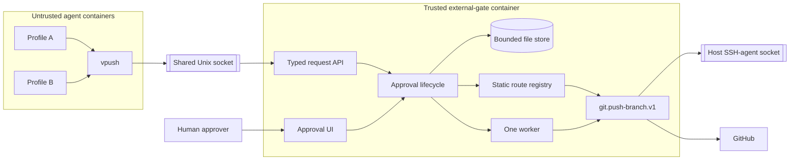
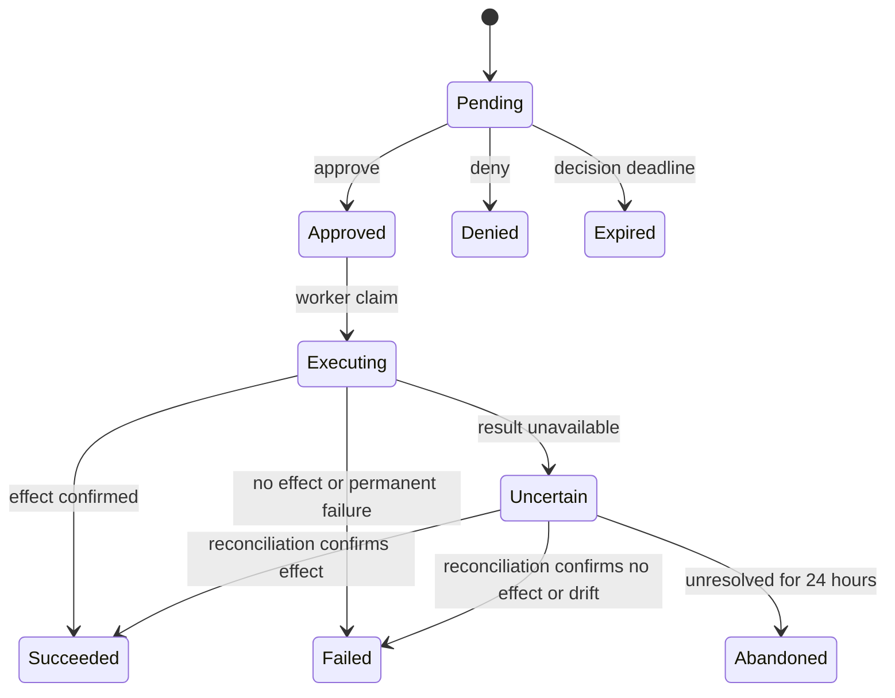

# Minimal External Gate Plan

## Goal

Replace the Git-push-specific host process with one hardened companion container
shared by every Vivarium profile. Implement only approved GitHub branch pushes
now, while making another reviewed action easy to add later.

The gate brokers typed actions. It is not a generic HTTP, shell, Git, network,
or credential proxy.

## Design decisions

- One `vivarium-external-gate` container serves every profile.
- Agents submit over a Unix socket; humans approve through a separate listener.
- Routes are static code registered by name. No plugins or dynamic commands.
- The only production route is `git.push-branch.v1`.
- One approval permits one external write attempt. There are no automatic write
  retries.
- One worker and a bounded file store are enough. No database or job framework.
- The gate requires an operator-provided, gate-dedicated SSH-agent socket holding
  exactly one configured GitHub key. It never receives private key files or the
  host home, and Vivarium does not create or load the agent.
- There is no backward compatibility. Old endpoints, variables, scripts, state,
  and pending approvals are not imported or supported.

Fixed MVP limits:

- 100 MiB maximum Git bundle;
- 20 open requests;
- 500 MiB total open-request bodies;
- 24-hour approval deadline;
- 1,000 retained terminal metadata records;
- one execution worker;
- one in-flight submission reader and one bounded approval handler;
- 1 GiB scratch `tmpfs` for Git quarantine work;
- 16 KiB maximum `request.json`, including an 8 KiB frozen action;
- 300-byte result, 20 description fields, 64-byte labels, 512-byte values, up to
  three bounded typed preview sections, and a 32 KiB rendered approval page;
- 120-second absolute upload deadline;
- approval port `7843`;
- host configuration keys `EXTERNAL_GATE_ENABLE`,
  `EXTERNAL_GATE_APPROVAL_PASSWORD`, `EXTERNAL_GATE_APPROVAL_MODE`,
  `EXTERNAL_GATE_APPROVAL_BIND_ADDR`, `EXTERNAL_GATE_PUBLIC_URL`, and
  `EXTERNAL_GATE_SSH_KEY_FINGERPRINT`.

## Architecture



## Trust and deployment boundaries

### Agent containers

Agents may control request metadata, bundle contents, timing, and volume. They
receive only `/run/vivarium-external-gate/request.sock`; they cannot reach gate
state, the SSH agent, host files, or the Docker socket. The approval API is never
exposed on this socket or a profile network. Because agents retain ordinary
network egress and may be able to route to a host-published address, approval
authentication remains mandatory rather than relying on network separation.

Profiles share one socket, UID, and global quota. Profile names are untrusted
display labels, not identity or authorization. Per-profile fairness is a
non-goal until it becomes an observed problem.

### External gate

The gate is trusted to enforce approval and use the mounted SSH signing
capability. It still treats every request and Git object as hostile. Browser form
fields never redefine a persisted action.

All route code in this container shares its capabilities. If a future route
needs a materially different or high-value credential, review whether it should
use a separate gate. Do not build executor isolation now.

### Deployment

- Run the gate under the fixed Compose project `vivarium-external-gate`.
- Do not attach it to profile networks.
- Mount only:
  - `~/.local/state/vivarium-external-gate` read-write;
  - `~/.local/share/vivarium-external-gate` for the request socket;
  - `~/.config/vivarium/external-gate.env` read-only;
  - the current host `SSH_AUTH_SOCK` at a fixed container path.
- Never mount the Docker socket, host home, source checkout, profile homes, or
  private key files.
- Bind approval to loopback by default. Validate listener bind and public origin
  as one tuple; the public URL must be an origin with no credentials, path,
  query, or fragment. Allow only:
  - direct loopback: listener `127.0.0.1:PORT` and public origin exactly
    `http://127.0.0.1:PORT`;
  - HTTPS proxy: listener `127.0.0.1:PORT` and an `https://HOST[:PORT]` public
    origin owned by the operator's proxy;
  - direct Tailscale: listener IP exactly equals `tailscale ip -4`; the HTTP
    public origin uses either that literal IP or a lowercase MagicDNS hostname
    that the host resolves exclusively to that IP, with the published port.
- Reject arbitrary LAN/WAN binds and mismatched HTTP origins. An `https://`
  public URL never permits the gate itself to expose plaintext on a non-loopback
  interface.

## API

### Agent-facing Unix listener

#### `POST /v1/requests/{route-name}`

For Git push:

```text
POST /v1/requests/git.push-branch.v1
Content-Type: application/x-git-bundle
```

The generic HTTP layer is single-reader and bounded. A 120-second monotonic
whole-upload deadline starts when the connection is accepted; per-read progress
does not reset it:

1. resolves the exact route from the static registry;
2. rejects unknown routes, wrong content types, `Transfer-Encoding`, duplicate
   or invalid `Content-Length`, and bodies outside the route limit;
3. atomically reserves the declared bytes against the open-body quota before
   reading;
4. applies connect/read deadlines and streams to a private temporary file while
   hashing;
5. asks the route to validate and freeze the action;
6. atomically publishes the complete request and converts the reservation into
   stored usage;
7. releases the reservation and removes the temporary directory on every
   failure;
8. returns the request ID and approval URL.

Startup removes abandoned temporary submissions before accepting requests. One
in-flight reader keeps aggregate upload memory, disk, and handler use bounded;
profiles already share one availability domain, so submission concurrency adds
no useful MVP behavior.

The core passes a route only its declared metadata headers, never the complete
HTTP header collection. The Git route declares exactly:

- `X-Vivarium-Profile`
- `X-Vivarium-Owner`
- `X-Vivarium-Repo`
- `X-Vivarium-Ref`
- `X-Vivarium-Old-Oid`
- `X-Vivarium-New-Oid`

Missing, duplicate, unknown route-metadata, or invalid values fail closed.

#### `GET /v1/requests/{id}`

Return only request ID, route, state, and sanitized result message.

#### `GET /healthz`

Return process and local-store liveness. It does not claim that GitHub or the SSH
agent is currently usable.

### Human-facing listener

- `GET /r/{id}` — authenticated page derived from the frozen action.
- `GET /r/{id}/status` — authenticated local-state read for active-page polling.
- `POST /r/{id}/approve` — one-shot approval.
- `POST /r/{id}/deny` — one-shot denial.
- `GET /healthz` — liveness check.

The generic page renders bounded metadata and optional typed route previews,
never route-supplied HTML. `Approved` and `Executing` pages poll a read-only
same-origin status endpoint with one nonce-scoped inline script, then reload only
when the durable state changes. There are no external assets.

Use the generated high-entropy approval password from the host-only `0600`
configuration file. Mount the file read-only; do not pass the password through
container environment variables.

Decision forms require CSRF protection. If `Origin` is present, it must match
the configured public origin. Missing `Origin` remains valid for embedded
browsers. Approval responses use `Referrer-Policy: same-origin`: this prevents
cross-origin referrer disclosure without causing normal browser form POSTs to
send the opaque `Origin: null`. Basic authentication is allowed only over
loopback or encrypted transport.

The browser listener cannot submit or inspect artifacts. The Unix listener
cannot approve, deny, retry, or perform administrative mutations. The browser
listener uses one bounded handler with request deadlines and a 4 KiB form-body
limit; human approval does not need unbounded request threads.

## Minimal route interface

```python
class ActionRoute:
    name: str
    content_type: str
    max_body_bytes: int
    metadata_headers: tuple[str, ...]

    def freeze(self, metadata, body_path, digest, size) -> JSONValue: ...
    def decode(self, frozen: JSONValue) -> object: ...
    def describe(self, action) -> list[tuple[str, str]]: ...
    def approval_sections(self, action) -> list[ApprovalSection]: ...
    def execute(self, action, body_path) -> ActionResult: ...
    def reconcile(self, action) -> ActionResult: ...
```

- `freeze()` receives only normalized, declared metadata and returns canonical
  JSON-compatible route data.
- `decode()` validates persisted frozen data on every reload before it reaches
  `describe()`, `execute()`, or `reconcile()`. Decode failure makes
  `Pending`/`Approved` terminal `Failed`; failure while loading
  `Executing`/`Uncertain` becomes terminal `Abandoned` with an explicitly unknown
  external outcome. Neither path executes a write.
- `describe()` returns label/value fields, never HTML.
- `approval_sections()` optionally returns bounded `text`, `code`, or `diff`
  sections; the trusted core escapes and renders them, so routes never return HTML.
- `execute()` performs at most one external write attempt.
- `reconcile()` reads external state but never retries a write.

`ActionResult` contains one state:

- `succeeded` — intended effect confirmed;
- `failed` — no further automatic work allowed;
- `uncertain` — effect cannot currently be established;

and an optional `restart_before_reconcile` flag. Only an `uncertain` result may
set this flag, for cases where the current gate process cannot prove an external
writer stopped.

The registry is static:

```python
ROUTES = {
    "git.push-branch.v1": GitPushRoute(),
}
```

A new route requires route code, one registry entry, tests, documentation, and
review of any added package or credential. It must not change generic HTTP
routing, approval lifecycle, or persistence.

Route names contain the route version. The request envelope has its own schema
version. A change that can alter an approved action's meaning requires a new
route name.

## Persistence and state

```text
requests/<request-id>/
  request.json
  body
```

`request.json` is at most 16 KiB and stores only:

- envelope schema version;
- random 128-bit ID;
- versioned route name;
- frozen action;
- body size and SHA-256 digest;
- state;
- creation, decision-deadline, state-change, and optional approval timestamps;
- sanitized result capped at 300 bytes.

The core rejects a frozen action over 8 KiB after canonical serialization.
Approval descriptions are capped at 20 fields, with 64-byte labels and 512-byte
values. Optional route previews are capped at three typed sections with bounded
titles, summaries, and content. The final page remains capped at 32 KiB. Route
code cannot inject HTML or expand persistent state/UI memory beyond core limits.

Do not add attempt counters or transition history.

Submission writes a private temporary directory, `fsync`s body and metadata,
atomically renames it into place, and `fsync`s the parent before returning.
Every later metadata transition uses an expected-current-state check, writes and
`fsync`s a temporary file, atomically renames it, and `fsync`s the request
directory before returning approval success, waking the worker, invoking Git, or
reporting a terminal result. Re-hash the body immediately before execution.

Delete the body after denial, expiry, success, failure, or entry into
`uncertain`; reconciliation uses only the frozen action. On startup, also remove
and directory-`fsync` bodies left attached to terminal, `Uncertain`, or
`Abandoned` records by a crash between state persistence and unlink. Keep at most
1,000 terminal records and prune the oldest on startup, submission, and every
terminal transition.

`Pending`, `Approved`, `Executing`, and `Uncertain` count toward the 20 open
requests. The atomic admission check also reserves the one in-flight body's
declared bytes before reading it.

Persisted `Approved` records are the queue. Do not add an in-memory work queue.
The worker scans approved records on startup. Approval transition and worker
notification use the same condition lock, then the worker scans the store; the
notification is only a wake-up and never the durable work record.

The same worker performs bounded maintenance every five minutes: expire pending
requests, reconcile at most two uncertain requests, then abandon uncertainty
older than 24 hours. Approved work is always claimed before maintenance. The
worker also expires pending requests on startup and before admission. This
releases quota without adding another worker or allowing agent status reads to
trigger network calls.

### State machine



Rules:

- The 24-hour limit is a decision deadline, not a total request lifetime.
- Under the state lock, approval checks the deadline and performs exactly one
  `Pending → Approved` transition; `now >= decision_deadline` becomes `Expired`
  instead.
- Worker claim atomically performs `Approved → Executing` with no second deadline
  check. Once approved in time, the request remains eligible for its one attempt.
- Persist `Approved` before waking the worker and `Executing` before the external
  call.
- On restart, execute `Approved` requests once and reconcile only `Executing` or
  `Uncertain` requests.
- If a crash occurs after storing `Executing` but before calling Git, a remote at
  the old OID becomes `Failed`; the user must submit and approve again.
- If GitHub is unreachable during reconciliation, retain `Uncertain`; each
  five-minute pass checks at most two such requests after approved work.
- After 24 hours in `Uncertain`, transition durably to terminal `Abandoned`,
  preserve the unresolved outcome in metadata, perform no write, and release the
  open-request slot. The user must inspect GitHub manually.
- Agent status reads never trigger network work.
- `Succeeded`, `Failed`, `Denied`, `Expired`, and `Abandoned` are immutable.

## Git push route

Preserve these restrictions:

- GitHub only.
- Canonical ASCII owner, repository, and `refs/heads/*` branch using the strict
  intersection of the existing client/server rules: owner starts and ends
  alphanumeric, repository starts alphanumeric and does not end in `.git`, and
  the branch passes both the existing denylist and `git check-ref-format`.
- One branch creation or fast-forward update.
- No deletes, tags, force updates, arbitrary refspecs, hooks, or Git LFS.
- Exactly one bundle `HEAD` at the approved commit.
- Strict verification in a fresh bare quarantine repository created only on the
  1 GiB scratch `tmpfs`, never on persistent state storage.
- Reconstruct `git@github.com:OWNER/REPOSITORY.git` internally.
- Check the remote OID immediately before pushing.
- Use `--force-with-lease` only as compare-and-set protection for the frozen old
  OID.
- Use absolute executables, scrubbed environment, bounded output, and subprocess
  deadlines.
- Deterministically remove quarantine directories; treat scratch `ENOSPC` as a
  bounded permanent request failure.
- During `freeze()`, perform bounded local bundle validation in scratch and store
  a small immutable commit/diff preview in the frozen action. The approval UI
  renders the escaped unified diff with line-aware highlighting; large diffs are
  explicitly truncated. Preview generation performs no network work and does
  not replace authoritative validation immediately before execution.

Use one authoritative owner/repository/ref validator in the route and mirror it
in `vpush`.

SSH must use `ssh -F /dev/null`, batch mode, strict host-key checking, disabled
forwarding/local commands/askpass/TTY, and a reviewed GitHub-only known-hosts
file in the image. Do not read host or user SSH configuration.

Run Git/SSH in a new process session. On timeout, terminate the process group,
wait for a bounded interval, kill the group, reap it, and verify that the writer
process group no longer exists before interpreting a remote-at-old result. If
complete writer shutdown cannot be proved, return `Uncertain` with
`restart_before_reconcile=true` and perform no remote query in that process.
The core durably persists `Uncertain`, immediately terminates the gate process,
and performs no further route work. Docker may restart only after the old
container process tree has exited; reconciliation begins in the new process.

After an interrupted or timed-out push:

- remote equals `new_oid` → `Succeeded`;
- remote equals `old_oid` → `Failed`, requiring a new approval;
- remote is another OID → `Failed` due to drift;
- remote cannot be queried → `Uncertain`.

## Credential and lifecycle handling

The gate uses a dedicated `SSH_AUTH_SOCK` supplied when
`external-gate.sh start` runs.

- Require an existing socket owned by the invoking host user.
- Require exactly one identity in that agent and require its SHA-256 public-key
  fingerprint to equal `EXTERNAL_GATE_SSH_KEY_FINGERPRINT` in the host config.
- Validate identity count and fingerprint through the mounted socket before the
  gate accepts requests and immediately before each Git execution; fail closed
  on an empty, locked, mismatched, or multi-key agent.
- Vivarium does not create the agent, load keys, copy keys, or manage its
  lifetime. The operator supplies a dedicated agent containing the intended
  GitHub key.
- Rerun `start` after the agent restarts or its socket changes.
- Do not promise unattended restart with an ephemeral login-session agent.

`scripts/external-gate.sh` provides:

```text
enable | start | stop | status | disable | password-reset | logs
```

Host lifecycle commands serialize on
`~/.local/state/vivarium-external-gate/lifecycle.lock`. The daemon separately
acquires `daemon.lock` in that state directory, nonblocking, for its lifetime. It
must acquire `daemon.lock` before reading or changing request state or unlinking
a stale request socket. A losing daemon exits without touching the active
owner's socket. Lifecycle commands never wait on `daemon.lock`, avoiding lock
inversion during stop/recreate.

When the optional gate is enabled, every unsafe or unavailable prerequisite
fails fast with `[FATAL]` and names `./scripts/external-gate.sh disable`. `start`
validates the complete listener/public-origin tuple and refuses to run if it
cannot prove an allowed pairing. For direct Tailscale mode, the bind must match
`tailscale ip -4`; a hostname public origin must resolve exclusively to that IP
on the host. Proxy mode keeps the gate listener on loopback.

`start` builds first, then fingerprints the SSH socket path/device/inode,
approval-config digest, and exact built image ID. It uses `docker compose up -d
--no-build --force-recreate` when that identity or the running container image
changes, and ordinary `up -d --no-build` otherwise. `password-reset` always
forces recreation. Before returning, check both Unix and approval liveness
endpoints.

`up.sh` and `rebuild.sh` start the gate when enabled and fail closed if its
prerequisites are invalid. `shell.sh` remains unchanged: it can enter an already
running profile, while its existing stopped-profile path still delegates to
`up.sh`. To start without a broken enabled gate, the operator explicitly runs
`external-gate.sh disable`; do not add a bypass flag. `vpush` fails safely when
the socket is unavailable.

`logs` prints only the last 200 bounded log lines without follow mode and does
not hold `lifecycle.lock` while reading them.

`remove.sh --everything` stops and removes the independent gate container but
preserves its state and configuration.

## Container hardening

`Dockerfile.external-gate`:

- minimal base pinned by immutable digest with Python, Git, OpenSSH client, and
  CA certificates; updates change the reviewed digest explicitly;
- copies only gate code and reviewed GitHub known-hosts data;
- no runtime package installation;
- final stage `USER vivarium` with host UID/GID build arguments;
- fixed `python -m external_gate` entrypoint.

`compose.external-gate.yaml`:

- fixed project/service name and `restart: unless-stopped`, so a deliberate
  safety exit restarts only after Docker has ended the old container process
  tree;
- `cap_drop: [ALL]`, no added capabilities;
- `no-new-privileges:true`;
- read-only root filesystem and a 1 GiB scratch `tmpfs` used for every Git
  quarantine repository;
- `cpus: 1.0`, `mem_limit: 2g`, and `pids_limit: 128`, so the 1 GiB scratch
  limit is reached before the container memory limit under expected Git usage;
- only the state, socket, config, and SSH-agent mounts listed above;
- approval publishing follows the enforced loopback/proxy/Tailscale matrix;
- no Docker socket, privileged mode, profile network, host home, or keys;
- Docker log rotation capped at three 10 MiB files.

Suppress request access logs. Structured lifecycle/state logs may include only
request ID, route, old/new state, and a fixed result code—never authorization,
request bodies, agent-controlled text, paths, URLs, or raw Git/SSH output.
Application code, not Compose, enforces body, request-count, persistent-storage,
handler, and worker limits.

## Clean cutover

There is no compatibility or state migration:

1. Disable and stop the old push gate before removing its implementation.
2. Leave old state/configuration untouched; they are not read by the new gate.
3. Build and start the new external gate with new paths and empty state.
4. Rebuild profiles so they receive the new socket mount and `vpush` client.
5. Verify `vpush` from two profiles, then remove old source files.

Old pending approvals and URLs stop working. Never run old and new executors at
the same time.

## File changes

Add:

```text
Dockerfile.external-gate
compose.external-gate.yaml
compose.external-gate-client.yaml
external_gate/__init__.py
external_gate/__main__.py
external_gate/gate.py
external_gate/git_push.py
external_gate/github_known_hosts
scripts/external-gate.sh
tests/test_external_gate.py
tests/test_git_push_route.py
```

Modify:

```text
scripts/vpush
scripts/profile.sh
scripts/profile-create.sh
scripts/up.sh
scripts/rebuild.sh
scripts/remove.sh
.dockerignore
.env.example
README.md
docs/implementation.md
```

Remove:

```text
scripts/push-gate.sh
scripts/push-gate-broker.py
compose.push-gate.yaml
tests/test_push_gate.py
```

Do not modify `shell.sh`, `skel/AGENTS.md`, or the main `Dockerfile` unless an
implementation constraint proves it necessary. The main Dockerfile already
copies `scripts/vpush`.

## Implementation order

1. Implement and test the generic lifecycle with a tiny fake route.
2. Extract the existing Git validation/execution into `GitPushRoute` and add
   explicit reconciliation outcomes.
3. Add the hardened image, standalone Compose project, client overlay, and
   serialized lifecycle script.
4. Update `vpush` and profile lifecycle integration.
5. Perform the clean cutover and remove the old implementation.
6. Update concise documentation.

Do not maintain two production implementations.

## Verification

Automated tests must prove:

- unknown routes and invalid/duplicate metadata fail;
- a fake route works without generic-core changes;
- `Transfer-Encoding`, duplicate lengths, partial/slow-drip bodies past the
  absolute deadline, and a second concurrent upload cannot bypass the
  single-reader and byte-reservation limits;
- failed uploads release reservations and startup removes orphan temporary data
  plus bodies left on terminal, `Uncertain`, or `Abandoned` records;
- publication and every state transition are crash-durable; injected crashes
  cannot turn persisted `Executing` back into `Approved`;
- digest changes prevent execution, frozen actions are decoded/validated on
  reload, and JSON/action/result/description/preview/page limits reject oversized
  route output;
- decisions and state transitions are one-shot, including approval exactly at
  the decision-deadline boundary;
- persisted approvals cannot be stranded by a process-local signal;
- startup recovery handles `Approved`, `Executing`, and `Uncertain`; five-minute
  maintenance expires `Pending`, reconciles no more than two `Uncertain` records
  after approved work, and durably moves 24-hour uncertainty to `Abandoned`;
- `Pending`, `Approved`, `Executing`, and `Uncertain` all count against open quota,
  while `Abandoned` releases it;
- request bodies, terminal metadata, temporary uploads, approval handlers, and
  Git quarantine storage remain bounded;
- terminal pruning runs when requests become terminal, not only on submission;
- all existing Git restrictions still hold;
- each reconciliation outcome is correct;
- timeout tests prove the Git/SSH process group is killed and reaped; if writer
  shutdown cannot be proved, no remote query runs in that process, `Uncertain`
  is persisted, the gate exits, and only the restarted container reconciles;
- a high-expansion bundle exhausts only the scratch tmpfs and fails cleanly;
- concurrent lifecycle starts produce one state owner and container; a losing
  daemon never unlinks the winner's socket;
- `vpush` preserves its command and user-visible submit/approval flow.

Container tests must prove:

- non-root final user, all capabilities dropped, read-only root;
- no Docker socket, host home, profile data, or private key mounts;
- agents see only the request socket;
- gate is not on profile networks;
- loopback, HTTPS-proxy, and verified-Tailscale listener/public-origin tuples
  work, including a MagicDNS hostname resolving only to the bound Tailscale IP,
  while arbitrary LAN/WAN binds, mismatched origins, and misleading HTTPS public
  URLs fail closed;
- multiple profiles use one gate;
- startup and pre-execution checks reject empty, locked, multi-key, or
  fingerprint-mismatched SSH agents, and changed SSH/config fingerprints recreate
  the container;
- source-only image rebuilds change the runtime identity and recreate the gate,
  while unchanged starts do not; both liveness endpoints are checked before
  startup succeeds;
- log contents and Docker rotation are bounded and contain no hostile or secret
  values;
- `remove.sh --everything` does not leave the gate running.

Use a manual GitHub test repository for the real mounted SSH-agent and
known-hosts path. Local bare-repository tests do not claim to cover it.

## Acceptance criteria

- One hardened gate serves all profiles.
- `vpush` keeps the same user flow and Git safety restrictions.
- Agents cannot approve or reach write credentials.
- Approval binds route, repository, ref, old/new OIDs, and body digest.
- Each approval causes at most one external write attempt.
- Restarts and ambiguous outcomes never cause automatic writes.
- Persistent state, uploads, handlers, Git scratch space, logs, and worker are
  bounded.
- A fake route proves extension without generic-core changes.
- A production route honestly requires route code, registry entry, tests, docs,
  dependency/config changes if needed, and credential review.
- Final non-root user, no Docker socket, no privileged mode, and
  `cap_drop: ALL` remain intact.

## Non-goals

- Legacy clients, endpoints, variables, state, or approval URLs.
- Generic outbound HTTP, shell commands, Git remotes, or credential brokerage.
- Dynamic plugins.
- Per-profile identity or fair queueing.
- Automatic write retries.
- A dashboard, database, distributed worker system, or general job queue.
- Managing SSH agents, private keys, GitHub Apps, PATs, or login sessions.
- Per-route executor isolation before a real credential requires it.
