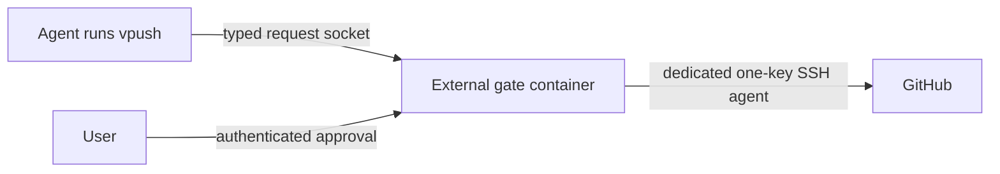

# vivarium implementation notes

Short reference for what the repo currently does. `README.md` is the user entry
point and safety contract.

## Architecture

The optional external gate is one standalone hardened container shared by all
profiles. Profiles receive only its Unix request socket and cannot reach gate
state, its SSH agent, or its container network. Agents may still route to a
host-published approval address, so Basic authentication and CSRF checks remain
mandatory. The only production route is
`git.push-branch.v1`. A bounded durable file store, one worker, and explicit
`Executing`/`Uncertain` reconciliation prevent automatic write retries. Pending
approval expires after 24 hours; unresolved uncertainty is abandoned after a
further 24 hours. The generic approval page renders only bounded typed sections.
Its reusable `external_gate/diff_viewer.py` module validates immutable canonical
JSON diff artifacts and renders escaped per-file, paginated side-by-side diffs
with bounded intra-line highlights. Git preview content is limited to 1 MiB and
20,000 lines overall, 500 KiB and 20,000 lines per file, and 300 listed files;
oversized and binary files retain explicit summaries while other files remain
reviewable. Pending preview sidecars are digest-bound to request metadata and
removed when a decision is recorded. Existing schema-v1 requests remain
readable. A nonce-scoped poller reloads active pages only when their durable
state changes. Gate startup fingerprints
the exact built image so source-only rebuilds recreate a stale container. The
gate is disabled by default.

- Docker image: `vivarium:latest`
- default container name: `vivarium`; named profiles use `vivarium-<profile>`
- base image: `ubuntu:24.04`
- final user: `vivarium`
- mounted home: `${VIVARIUM_HOME:-$HOME/vivarium-home[-profile]}:/home/vivarium`
- work dir: `/home/vivarium/work`
- default host work dir: `~/vivarium-home/work`; profile work dirs default to `~/vivarium-home-<profile>/work`

## Runtime hardening

From `compose.yaml` for each profile:

- `cap_drop: [ALL]`
- `cap_add: [CHOWN, DAC_OVERRIDE, FOWNER, SETUID, SETGID]`
- `no-new-privileges:true`
- `mem_limit: 4g`
- `cpus: 2.0`
- `pids_limit: 512`
- no Docker socket mount
- no privileged mode

The standalone gate additionally has no added capabilities, a read-only root,
a 4 GiB scratch tmpfs, 1 CPU, 6 GiB memory, 128 PIDs, bounded logs, and only
state/socket/config/dedicated-agent mounts. It never joins profile networks.

## Image contents

Base tools include git, GitHub CLI (`gh`), curl, tmux, editors, build tools,
ripgrep, fd, jq, sqlite, Go, Rust/cargo, Python, Node 26, npm, and uv.
`/usr/local/bin/gh` wraps `/usr/bin/gh` and supplies `GH_TOKEN` from Git's
credential cache when available, so no separate `gh auth login` token is stored
on disk.

Optional build flags:

- `INSTALL_OPENCODE=true` — install opencode
- `INSTALL_CLAUDE=false` — install claude code
- `INSTALL_PASEO=false` — install paseo
- `INSTALL_BESTIARY=false` — install bestiary from `BESTIARY_REF`
- `AI_HARNESSES_REF=main` — ai-harnesses ref to bake into the image
- `AI_HARNESSES_MCP=none` — `none`, `all`, or comma-list such as `github,bestiary,atlassian`

Runtime UI flags:

- `OPENCODE_WEB_ENABLE=true` — start unauthenticated `opencode web` on port `4096` by default when opencode is installed
- `OPENCODE_WEB_BIND_ADDR` — host address for the published OpenCode port; defaults to `PASEO_BIND_ADDR`, then `127.0.0.1`
- `OPENCODE_WEB_PORT=4096` — host port for OpenCode web; container still listens on `4096`
- `PASEO_ENABLE=true` — start Paseo alongside OpenCode web

At least one of `INSTALL_OPENCODE` or `INSTALL_CLAUDE` must be true.
Docker builds use an allowlisted `.dockerignore`; the Nix install is split into
its own cached layer before the ai-harnesses profile build.

## Script behavior

- Most scripts accept `[profile|env-file]`. No argument uses `.env`; a name uses
  `profiles/<name>.env`; a path can point at an external env file.
- `scripts/profile-create.sh` creates ignored `profiles/<name>.env` files.
- `scripts/up.sh` creates/updates the selected env file, resolves moving build
  refs and `PI_VERSION=latest`, creates the host work dir, builds, starts the
  container, reapplies global agent rules, and calls `scripts/git-auth.sh` to
  prime the in-container Git credential cache when `GITHUB_READ_TOKEN` is set.
- `scripts/rebuild.sh` also resolves moving build refs and the latest stable Pi
  release, rebuilds the image, recreates the container, preserves
  `VIVARIUM_HOME`, and supports `--no-cache`/`--fresh` for a full image rebuild.
- `scripts/git-auth.sh` re-primes a running container's GitHub HTTPS clone/`gh`
  credential from `GITHUB_READ_TOKEN` without writing `~/.git-credentials`.
- `scripts/external-gate.sh` serializes lifecycle operations for the shared gate;
  `vpush` submits the current branch without exposing host SSH credentials.
- Enabled profiles add only `compose.external-gate-client.yaml`; `up.sh` and
  `rebuild.sh` fail closed if gate startup validation fails.
- `remove.sh --everything` removes the gate container but preserves its host
  configuration and request state.
- `scripts/shell.sh` starts the selected profile if needed, re-primes GitHub
  HTTPS clone credentials for already-running containers when
  `GITHUB_READ_TOKEN` is set, and opens bash.
- `scripts/update.sh` refuses tracked local changes, fast-forwards from
  `origin/main`, then delegates to `scripts/rebuild.sh` for the selected
  profile.
- `scripts/backup.sh` rsyncs the selected `VIVARIUM_HOME/work` into rotating
  backup slots.
- `scripts/audit.sh` checks selected container state, backup freshness, repo
  remotes, secret-like tracked files, risky git config, MCP drift, and `.ssh`
  files.
- `scripts/cron-install.sh` installs backup/audit cron entries for a profile.
- `scripts/cron-uninstall.sh` removes vivarium cron entries.
- `scripts/remove.sh` removes container/image/cron by default; `--data`,
  `--backups`, and `--everything` opt into destructive removal.

## Entrypoint behavior

On container start, `entrypoint.sh`:

- copies skeleton home files, including `.bashrc` and `AGENTS.md`, only if `.bashrc` is missing
- reapplies `skel/AGENTS.md` to Pi, opencode, and Claude Code global rule paths every start
- appends `$HOME/.local/bin` to PATH instead of prepending it
- reapplies safe global git config
- removes plaintext `~/.git-credentials`
- creates `~/work`
- reapplies baked yolo ai-harnesses configs every start
- runs Pi from the immutable image and links baked npm/git package code into
  the mounted home; Pi auth, sessions, MCP auth, trust, and Hermes data remain
  mutable and persistent
- keeps `PI_OFFLINE=1` for startup and `docker compose exec` sessions so Pi
  skips network/package update checks against immutable package code
- starts OpenCode web when `OPENCODE_WEB_ENABLE=true` and `opencode` is installed
- starts Paseo when `PASEO_ENABLE=true` and `paseo` is installed
